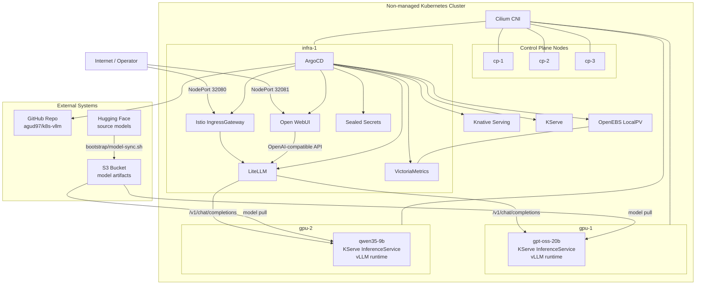

# Architecture

## Current Lab Topology

## Request Paths

- Public inference: `Internet -> NodePort 32080 -> Istio -> LiteLLM -> model-specific KServe/vLLM predictor`
- Public UI: `Internet -> NodePort 32081 -> Open WebUI -> LiteLLM -> predictor`
- GitOps control: `ArgoCD -> GitHub repository -> platform/apps reconciliation`
- Model supply: `Hugging Face -> S3 sync -> KServe storage initializer -> GPU nodes`

## Node Roles

- `cp-1`, `cp-2`, `cp-3`: Kubernetes control plane and `etcd`
- `infra-1`: ingress, GitOps, API gateway, UI, metrics
- `gpu-1`: `gpt-oss-20b`
- `gpu-2`: `qwen35-9b`

## Serving Layout

- `LiteLLM` is the only public inference entrypoint.
- `Open WebUI` uses internal `LiteLLM`, not direct model backends.
- Each model is exposed internally through one OpenAI-compatible vLLM endpoint.
- Phase-1 serving is non-distributed: one model per GPU node.
